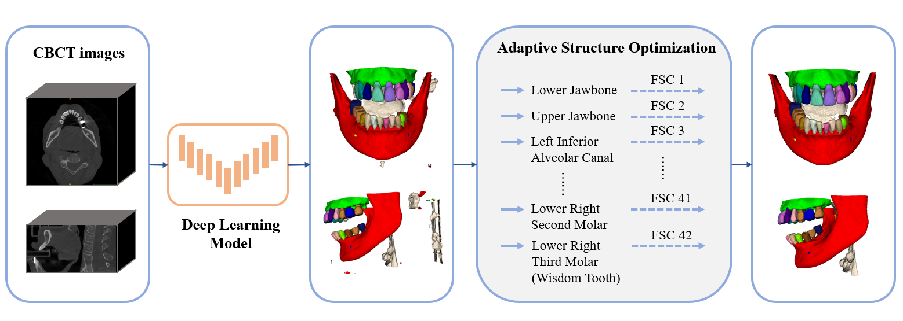

# Multi-Structure Segmentation for MICCAI 2024 ToothFairy2 Challenge
Solution for [MICCAI 2024 ToothFairy2 Challenge](https://toothfairy2.grand-challenge.org/) based on nnUNet.



## Environments and Requirements:
### 1. nnUNet Configuration
Install nnU-Net as below.  
You should meet the requirements of nnUNet, our method does not need any additional requirements.  
For more details, please refer to https://github.com/MIC-DKFZ/nnUNet  
```
git clone https://github.com/MIC-DKFZ/nnUNet.git
cd nnUNet
pip install -e .
```
### 2. Final Model Encapsulation using Docker
Build the docker based on `dockerfile`
```
sh build.sh
```
Save the docker images if needed.
```
sh export.sh
```
